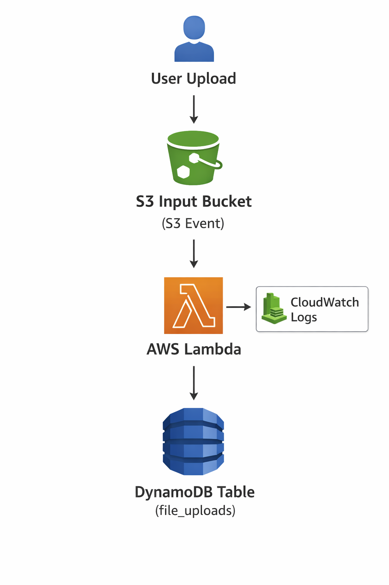

# Serverless File Upload Logger

This project is an **event-driven file upload logger** using AWS:

- Upload files to S3
- Trigger AWS Lambda
- Log metadata to DynamoDB
- Lambda logs to CloudWatch

## Architecture Diagram

## How to Test

1. Upload a file to the `file-upload-logger-input` S3 bucket
2. Check DynamoDB table `file_uploads` for metadata
3. View logs in CloudWatch

## Tech Stack

- AWS S3, Lambda, DynamoDB
- Terraform for infrastructure as code
- Python for Lambda
